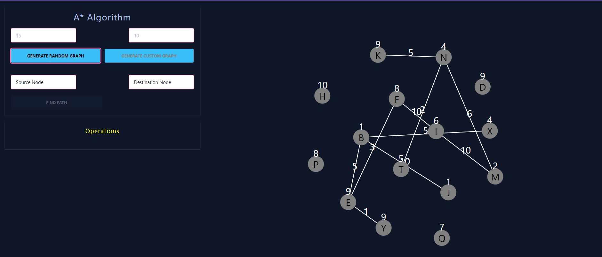
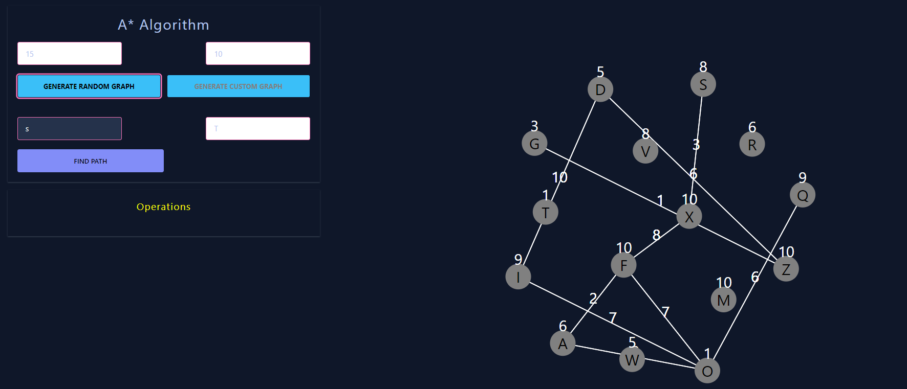
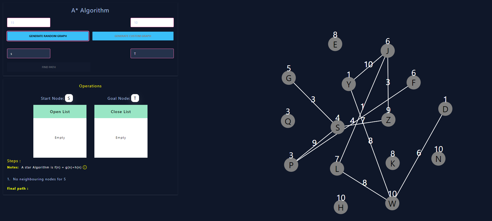
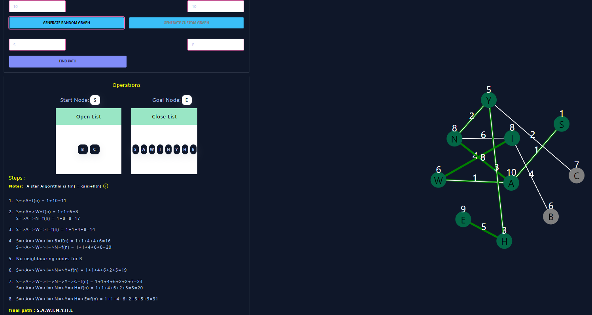

### Theory

A* Search algorithm is one of the best and popular techniques used in path-finding and graph traversals.
It is a searching algorithm that is used to find the shortest path between an initial and a final point.
The A* Search Algorithm also uses a heuristic function that provides additional information regarding how
far away from the goal node we are.

<h5>Algorithm For A* search</h5>

 <ol>
 <li>Initialization:</li>
 <ul>
                <li>Define two lists: OPEN and CLOSED.</li>
                <li>Add the start node S to the OPEN list.</li>
                </ul>
            <li>Check OPEN List:</li>
            <ul>
                <li>If the OPEN list is empty, the algorithm fails to find a solution and exits.</li>
            </ul>
        <li>Select Node:</li>
            <ul>
                <li>Remove the node with the smallest value of f(n) from the OPEN list.</li>
                <li>Move this node to the CLOSED list.</li>
                <li>If the selected node is the goal state, return success and exit.</li>
            </ul>
         <li>Expand Node:</li>
            <ul>
                <li>Expand the selected node by generating its successor nodes.</li>
            </ul>
          <li>Goal Test:</li>
            <ul>
                <li>For each successor node, check if it is the goal node.</li>
                <li>If a successor is the goal node, return success and the solution by tracing the path from the start node to the goal node.</li>
                <li>If not, proceed to the next step.</li>
            </ul>
        <li>Evaluation and Add to OPEN List:</li>
            <ul >
                <li>For each successor node:</li>
                <li>Apply the evaluation function f to calculate its value.</li>
                <li>If the successor node has not been visited (neither in OPEN nor CLOSED list), add it to the OPEN list.</li>
            </ul>
        <li>Repeat:</li>
            <ul>
                <li>Go back to step 2 and continue the process until a solution is found or the OPEN list is empty.</li>
            </ul>
            </ol>

For example:

  
Step - 1 Enter the number of nodes and number of links, then click on "Generate Random graph"

  
  
Step - 2 Enter Source node and Destination node

  
  
Step - 3 Observe the operation. If the OPEN list is empty, the algorithm fails to find a solution and exits.

  
  
Step - 4 Final output is displayed

  

